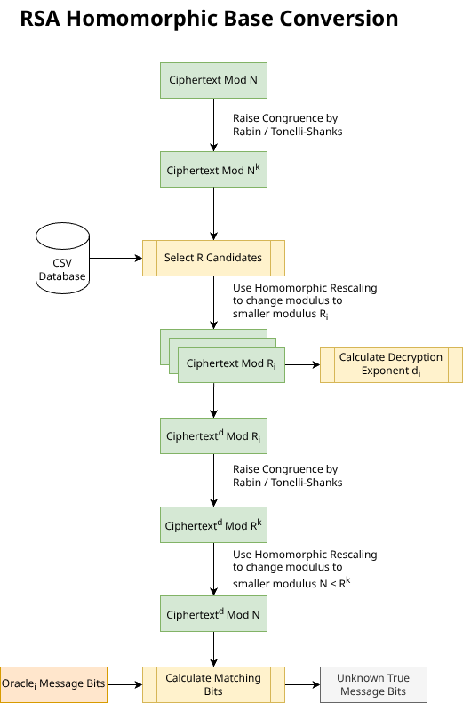
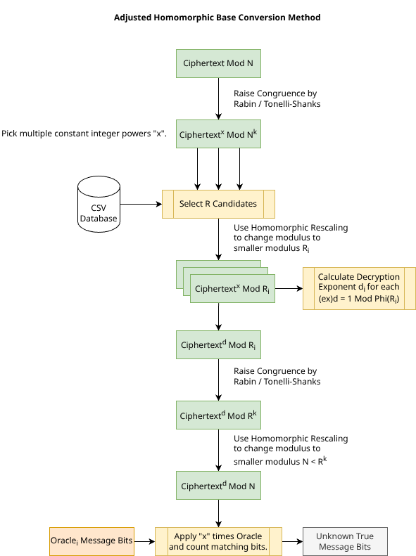
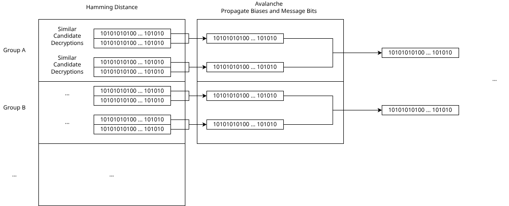

AI was used to build this proof-of-concept.

# Architecture

This project is an RSA experiment runner centered on the `analysis` pipeline. The code first validates a normal RSA round trip, then measures how much information can be recovered when ciphertexts are transformed into alternate, easier-to-factor candidate moduli and decoded there. The current implementation is driven mainly by `src/bin/analysis.rs`, `src/methods.rs`, `src/r_candidates.rs`, and the session analytics layer in `src/analytics.rs`.

The older description of switching from `N^k` and using `get_larger_number` is no longer accurate for the analysis path. The current code does not pivot to a single integer-power modulus such as `N^k`. Instead, it retargets candidates using decimal exponents, so the right mental model is a generic fractional-power construction such as `N^{a/b}` or, more generally, `N^\alpha`.

## Analysis Model

The baseline RSA values are still the familiar ones:

$$
N = pq,\qquad \varphi(N) = (p - 1)(q - 1),\qquad c = m^e \bmod N.
$$

The analysis then constructs speculative candidate moduli `r` and corresponding alternate decryption exponents. The key current idea is:

$$
r = \prod_{i=1}^{3} p_i,
\qquad
p_i = \operatorname{nextPrime}\!\left(\left\lfloor N^{\alpha_i} \right\rfloor\right),
$$

with randomly partitioned decimal exponents satisfying

$$
\alpha_i \ge 0.45,
\qquad
\sum_{i=1}^{3} \alpha_i = \alpha_{\text{target}}.
$$

So the resulting candidate modulus is approximately

$$
r \approx N^{\alpha_{\text{target}}}.
$$

That target exponent is stored as a decimal `BigDecimal`, so it can represent values like `0.87`, `2.005`, or any other fractional quantity that should be understood mathematically as something in the `N^{a/b}` family rather than only `N^k`.

## Core Logic

The analysis path used by `cargo run --bin analysis` is:

1. Build or load an RSA keypair, compute `N`, `\varphi(N)`, choose `e`, derive `d`, and verify the normal RSA round trip.
2. Generate a batch of candidate `r` values from either:
   - factoring mode, or
   - small-primes mode, generating fresh raw seeds per batch.
3. Retarget each generated candidate into a speculative modulus using the fractional-power construction above. In practice this means the originally generated `r` is just a seed; the analysis uses the retargeted modulus and its explicit factor list.
4. Compute

   $$
   \varphi(r)
   $$

   from the stored factors and keep only candidates for which the needed modular inverse exists.
5. Optionally create ciphertext variants

   $$
   c_x = c^x \bmod N,
   \qquad
   e_x = ex.
   $$

   When `ciphertext_modify` is enabled, the code uses increasing odd `x` values. It now retries until it has collected the requested number of ciphertext variants whose inverses actually exist for the target batch. In other words, the batch logic no longer silently burns a slot on a non-invertible `(e x)`.
6. Convert each ciphertext into candidate-modulus space with the HBC transform:

   $$
   \widetilde{c}_r = \operatorname{HBC}(c_x, r, N).
   $$

7. Decrypt in candidate-modulus space using

   $$
   d_r \equiv e^{-1} \pmod{\varphi(r)}
   $$

   for the normal case, or

   $$
   d_{r,x} \equiv (ex)^{-1} \pmod{\varphi(r)}
   $$

   when ciphertext variants are enabled.
8. Convert the candidate-space result back to the original modulus domain:

   $$
   m_r =
   \operatorname{HBC}\!\left(
     \widetilde{c}_r^{\,d_{r,x}} \bmod r,
     N,
     r
   \right)
   \bmod N.
   $$

9. Compare the recovered candidate bits against the true message bits. This is an analysis experiment, so the code scores each candidate against the known plaintext and records match percentages, best `c^x` hits, and per-candidate analytics.

## Current Batch Analysis

The main modern analysis loop is `run_r_candidate_accuracy_batches` in `src/methods.rs`.

Each batch:

- chooses one message under `N`,
- encrypts it once to get a base ciphertext,
- evaluates many retargeted `r` candidates,
- optionally evaluates many ciphertext variants `c^x`,
- records every candidate decryption and its match score,
- tracks the best-performing `c^x` instance in the batch,
- and emits structured analytics for the viewer and offline scripts.

If `same_r_batch` is enabled, one `r` is reused across the batch and the varying information comes from different valid `x` values. Otherwise, the batch uses multiple distinct `r` candidates.

## Avalanche And Beam Stage

After the batch has produced scored candidate decryptions, the code builds a second-stage search over those results.

The current logic is:

1. Rank scored candidate decryptions by bit-match percentage.
2. Sample many avalanche combinations from the full scored batch.
3. Turn each sampled decryption bit-vector into an `AvalancheNode`.
4. Run avalanche reduction with similarity tracking.
5. Convert the avalanche result into beam-search probabilities.

There are two probability sources:

- majority-vote probabilities over the sampled oracle outputs, or
- normalized avalanche biases from the tree result.

Those probabilities are then spread by the configurable exponent:

$$
P_{\text{beam}} = \operatorname{spread}(P, \gamma),
$$

where `\gamma` is `avalanche_probability_spread_exponent`.

Beam search then produces the top candidate bit-vectors. The selected sample is currently the one with the highest average source score, with top beam score used as the tie-breaker. The printed summaries include:

- the best avalanche beam sample,
- the best majority-vote sample when enabled,
- the best `c^x` run match,
- total evaluated `c^x` candidates,
- and total evaluated avalanche candidates.

One detail worth noting: although a config field named `avalanche_combination_pool_size` still exists for compatibility and logging, the current sampled-avalanche path uses the full scored batch as its sampling pool.

## What Is Obsolete

The following descriptions should be considered obsolete for the current analysis implementation:

- The idea that the analysis changes modulus to a single `N^k`.
- Any explanation centered on a `get_larger_number` helper.
- Treating the ciphertext-stream `c^x mod N` candidate generator in `src/r_candidates.rs` as the main analysis path.

What the current code actually does is:

- generate or reuse candidate seeds,
- retarget them into products of primes near fractional powers of `N`,
- require real modular inverses for the exponents it uses,
- score recovered plaintext bits directly,
- and then aggregate those scored outputs with sampled avalanche and beam search.

## Scope

This document describes the core logic used in the modern analysis path. It intentionally does not walk through every helper, export routine, viewer panel, or plotting utility. Those are supporting tools around the core experiment, not the architecture-defining path.

## References

- `src/bin/analysis.rs`
- `src/methods.rs`
- `src/r_candidates.rs`
- `src/analytics.rs`
- `scripts/run_small_batch_beam.sh`
- `scripts/run_medium_batch.sh`

## Diagrams

**RSA Homomorphic Base Conversion Method**

**Adjusted Homomorphic Base Conversion Method**

**Avalanche Tree Method**

